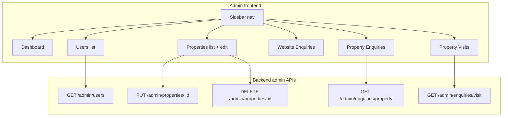

# Admin CMS for Backend Data

## Goal

Turn `/admin` into a proper CMS so admin users can manage all backend data (users, properties, website enquiries, property enquiries, property visits) from one GUI, with a sidebar and dedicated list/edit pages.

## Current state

- **Admin frontend:** Login at `/admin`, dashboard at `/admin/dashboard` with Website Enquiries list + export and logout. No sidebar; no other sections.
- **Backend:** No `isAdmin` or role. Auth is token-based; no admin-only routes. User profile does not return `isAdmin`. Property edit/delete are owner-scoped under `/user/properties/`*. Enquiry/visit list APIs are per-property only.

## Architecture

---

## Part 1: Backend – Admin role and APIs

### 1.1 Add `isAdmin` and enforce it

- **Schema:** In [backend/prisma/schema.prisma](backend/prisma/schema.prisma), add `isAdmin Boolean @default(false)` to the `User` model.
- **Migration:** Create and run a new migration.
- **Seed:** In [backend/prisma/seed.js](backend/prisma/seed.js), set `isAdmin: true` for one user (e.g. `rahul@example.com`).
- **Profile:** In [backend/src/routes/user.js](backend/src/routes/user.js), include `isAdmin` in the `select` and response for `GET /user/profile` (so the frontend can gate admin UI and the guard can redirect non-admins).
- **Auth middleware:** Today [backend/src/middleware/auth.js](backend/src/middleware/auth.js) sets `req.user = { id }`. Either:
  - **Option A:** In auth middleware, after verifying the token, load the user from DB (select `id`, `isAdmin`) and set `req.user = { id, isAdmin }` so admin routes can rely on it; or
  - **Option B:** Keep auth as-is and add a separate `adminMiddleware` that runs after auth, loads the user by `req.user.id`, checks `isAdmin === true`, and returns 403 otherwise.
- **Admin middleware:** New file e.g. [backend/src/middleware/admin.js](backend/src/middleware/admin.js): runs after `authMiddleware`, ensures `req.user.isAdmin === true` (or loads user and checks), else 403.

### 1.2 Admin routes

- **Router:** New file [backend/src/routes/admin.js](backend/src/routes/admin.js), mounted at `/admin` in [backend/src/routes/index.js](backend/src/routes/index.js). All routes use `authMiddleware` and `adminMiddleware` (or a single middleware that does auth + isAdmin).
- **Users (read-only list):**
  - `GET /admin/users?page=&limit=` – List users; select `id`, `name`, `email`, `mobileNo`, `createdAt` (never `passwordHash`). Return same list shape as other list endpoints (`result`, `pagination`).
- **Properties (admin override for edit/delete):**
  - `PUT /admin/properties/:id` – Update any property by id. Reuse the same update body shape and logic as [backend/src/routes/user.js](backend/src/routes/user.js) `buildPropertyUpdate` and `propertyToResponse`. Do not check ownership.
  - `DELETE /admin/properties/:id` – Delete any property by id. Do not check ownership.
- **Enquiries and visits (list all):**
  - `GET /admin/enquiries/property?page=&limit=` – List all property enquiries (join or include property id/title if helpful). Same pagination shape.
  - `GET /admin/enquiries/visit?page=&limit=` – List all property visits (include property id/title). Same pagination shape.

Existing endpoints can stay as-is: website enquiry getAll/export remain under `/enquiry/website/`*; they are already auth-only. Optionally you can later restrict them to admins by using the same admin middleware on those routes.

---

## Part 2: Frontend – CMS layout and pages

### 2.1 Enforce admin role in the guard

- In [src/components/molecules/admin/AdminAuthGuard.jsx](src/components/molecules/admin/AdminAuthGuard.jsx): For paths other than `/admin` (login), after ensuring the token exists, ensure the user is admin. If the store does not have the user yet, call `getProfile` (or an equivalent that uses the stored token) and store the result; then if `user?.isAdmin !== true`, redirect to `/admin` with a message (e.g. “Admin access required”) and do not render protected content. This requires the backend to return `isAdmin` in the profile response as above.

### 2.2 Admin layout with sidebar

- Add a persistent **sidebar** to the admin layout (for routes under `/admin` except the login page). Reuse or mirror the pattern from the user dashboard sidebar ([src/components/molecules/dashboard/AppSidebar.jsx](src/components/molecules/dashboard/AppSidebar.jsx)) so the admin area has a clear nav.
- **Sidebar links:**
  - Dashboard → `/admin/dashboard`
  - Users → `/admin/users`
  - Properties → `/admin/properties`
  - Website Enquiries → `/admin/enquiries/website`
  - Property Enquiries → `/admin/enquiries/property`
  - Property Visits → `/admin/visits`
- Layout structure: Keep [src/app/(admin)/layout.jsx](src/app/(admin)/layout.jsx) with `AdminAuthGuard`; inside the guarded content, when pathname is not `/admin`, render the sidebar + main content area (outlet). You can introduce an `AdminShell` client component that wraps the sidebar and `children` for `/admin/dashboard`, `/admin/users`, etc.

### 2.3 Dashboard page

- Keep [src/app/(admin)/admin/dashboard/page.jsx](src/app/(admin)/admin/dashboard/page.jsx) as the main overview. Optionally add summary cards (e.g. total users, total properties, total website enquiries) if you add lightweight count APIs or derive from existing list responses. Otherwise leave the current website enquiries list and export as-is and ensure this page is the default after login.

### 2.4 Users page

- **Route:** `src/app/(admin)/admin/users/page.jsx` (or under a route group so the URL is `/admin/users`).
- **Content:** Table (or card list) of users: name, email, mobileNo, createdAt. Pagination (e.g. page size 20). Use a new server action or client fetch that calls `GET /admin/users`.
- **Frontend action:** New function (e.g. in `src/actions/admin.js`) that calls `GET /admin/users?page=&limit=` and returns `{ result, pagination }`. No create/edit/delete required for this scope.

### 2.5 Properties page (list + edit/delete)

- **List:** `src/app/(admin)/admin/properties/page.jsx` – URL `/admin/properties`. List all properties using existing `getAllProperty` or `filterProperty` (no new backend needed for list). Display key fields (title, city, locality, price, listing type) and a link or button to “Edit” and “Delete”.
- **Edit:** `src/app/(admin)/admin/properties/[id]/edit/page.jsx` – URL `/admin/properties/[id]/edit`. Reuse the same edit form logic and fields as the user dashboard edit page ([src/app/(user)/(authenticate)/dashboard/edit/[propertyId]/page.jsx](src/app/(user)/(authenticate)/dashboard/edit/[propertyId]/page.jsx)). Use `getOneProperty(propertyId)` for initial data. On submit, call a new **admin** action that uses `PUT /admin/properties/:id` instead of the user-scoped update. On delete, call a new admin action that uses `DELETE /admin/properties/:id`, then redirect to `/admin/properties`.
- **Actions:** Add in `src/actions/admin.js` (or similar): `updatePropertyAdmin(id, body)`, `deletePropertyAdmin(id)`, both using `fetchWithToken` to the new admin endpoints.

### 2.6 Website Enquiries page

- **Route:** `src/app/(admin)/admin/enquiries/website/page.jsx` – URL `/admin/enquiries/website`. Move or duplicate the current website enquiries list and “Export CSV” (date range) from the dashboard into this page so “Website Enquiries” in the sidebar has a dedicated page. The dashboard can keep a shortened version or a link to this page.

### 2.7 Property Enquiries page

- **Route:** `src/app/(admin)/admin/enquiries/property/page.jsx` – URL `/admin/enquiries/property`. List all property enquiries in a table: name, email, mobile, message, property id/title, createdAt. Pagination. New action that calls `GET /admin/enquiries/property?page=&limit=`.

### 2.8 Property Visits page

- **Route:** `src/app/(admin)/admin/visits/page.jsx` – URL `/admin/visits`. List all property visits: name, email, mobile, preferredDate, property id/title, createdAt. Pagination. New action that calls `GET /admin/enquiries/visit?page=&limit=`.

---

## Part 3: Shared and optional improvements

- **API base:** All new admin actions use the same `fetchWithToken` and base URL as the rest of the app; only the path prefix is `/admin/...`.
- **Docs:** Update [docs/API.md](docs/API.md) with the new admin endpoints and the requirement that the user must have `isAdmin: true` (e.g. via Bearer token of an admin user).
- **Optional:** Add simple count endpoints (e.g. `GET /admin/stats` returning `{ users, properties, websiteEnquiries }`) for dashboard cards; otherwise skip and keep the dashboard as-is.

---

## Files to add or touch (summary)

| Layer    | File                                                                                                   | Change                                                                                                     |
| -------- | ------------------------------------------------------------------------------------------------------ | ---------------------------------------------------------------------------------------------------------- |
| Backend  | [backend/prisma/schema.prisma](backend/prisma/schema.prisma)                                           | Add `isAdmin Boolean @default(false)` to User                                                              |
| Backend  | New migration                                                                                          | For isAdmin                                                                                                |
| Backend  | [backend/prisma/seed.js](backend/prisma/seed.js)                                                       | Set isAdmin: true for one user                                                                             |
| Backend  | [backend/src/routes/user.js](backend/src/routes/user.js)                                               | Return isAdmin in GET /user/profile                                                                        |
| Backend  | [backend/src/middleware/auth.js](backend/src/middleware/auth.js) or new admin.js                       | Load isAdmin for req.user or add adminMiddleware                                                           |
| Backend  | New [backend/src/routes/admin.js](backend/src/routes/admin.js)                                         | GET users; PUT/DELETE properties/:id; GET enquiries/property, enquiries/visit                              |
| Backend  | [backend/src/routes/index.js](backend/src/routes/index.js)                                             | Mount admin routes at /admin                                                                               |
| Frontend | [src/components/molecules/admin/AdminAuthGuard.jsx](src/components/molecules/admin/AdminAuthGuard.jsx) | Enforce isAdmin (getProfile, redirect if !isAdmin)                                                         |
| Frontend | Admin layout + new sidebar component                                                                   | Sidebar with Dashboard, Users, Properties, Website Enquiries, Property Enquiries, Visits                   |
| Frontend | [src/app/(admin)/admin/dashboard/page.jsx](src/app/(admin)/admin/dashboard/page.jsx)                   | Keep; optionally link to /admin/enquiries/website                                                          |
| Frontend | New src/app/(admin)/admin/users/page.jsx                                                               | Users list + pagination                                                                                    |
| Frontend | New src/app/(admin)/admin/properties/page.jsx                                                          | Properties list with links to edit/delete                                                                  |
| Frontend | New src/app/(admin)/admin/properties/[id]/edit/page.jsx                                                | Reuse edit form; use admin update/delete actions                                                           |
| Frontend | New src/app/(admin)/admin/enquiries/website/page.jsx                                                   | Website enquiries list + export                                                                            |
| Frontend | New src/app/(admin)/admin/enquiries/property/page.jsx                                                  | Property enquiries list                                                                                    |
| Frontend | New src/app/(admin)/admin/visits/page.jsx                                                              | Property visits list                                                                                       |
| Frontend | New src/actions/admin.js                                                                               | getAdminUsers, updatePropertyAdmin, deletePropertyAdmin, getAdminPropertyEnquiries, getAdminPropertyVisits |
| Docs     | [docs/API.md](docs/API.md)                                                                             | Document admin endpoints and isAdmin                                                                       |

---

## Credentials

After implementation, only users with `isAdmin: true` (e.g. seeded `rahul@example.com` / `password123`) can access `/admin/dashboard` and all CMS sections. Non-admin users are redirected from protected admin routes to `/admin` with an “Admin access required” message.